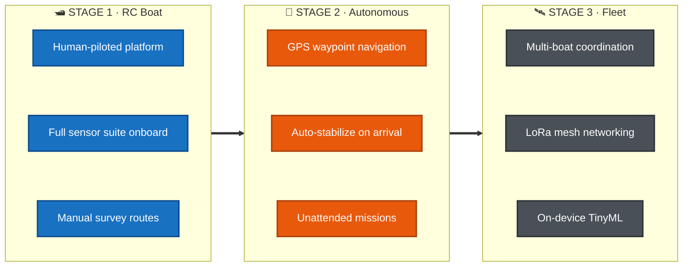
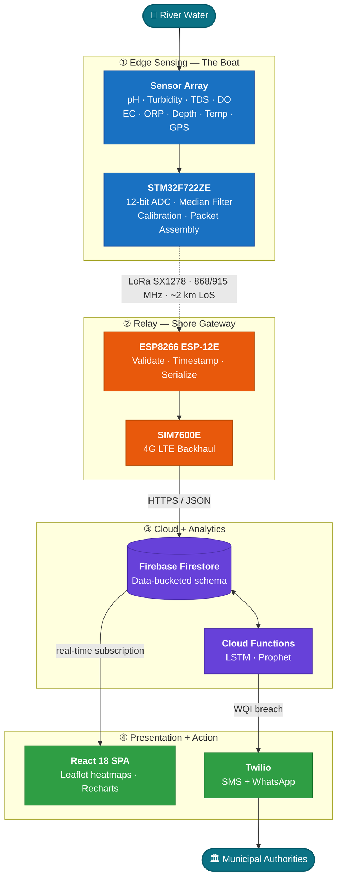
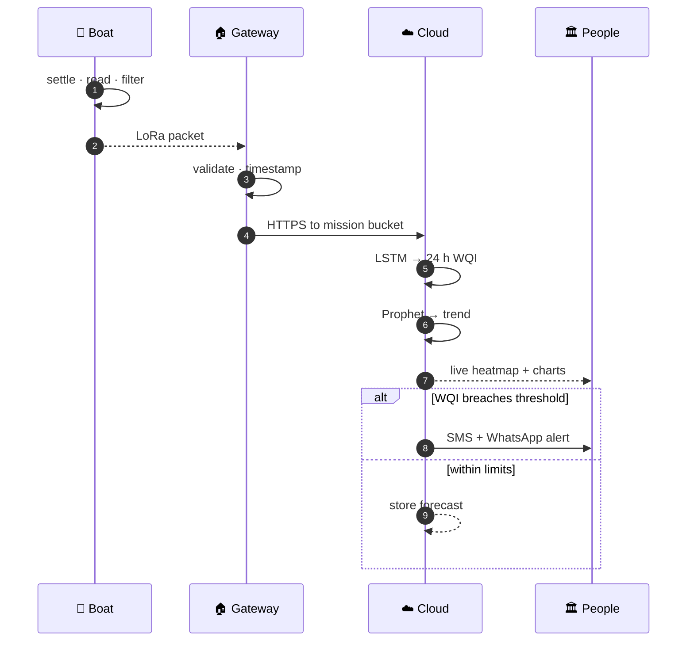
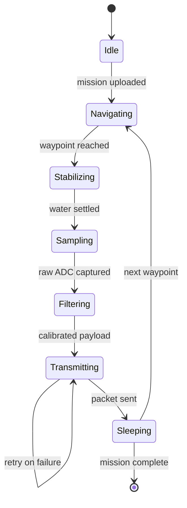
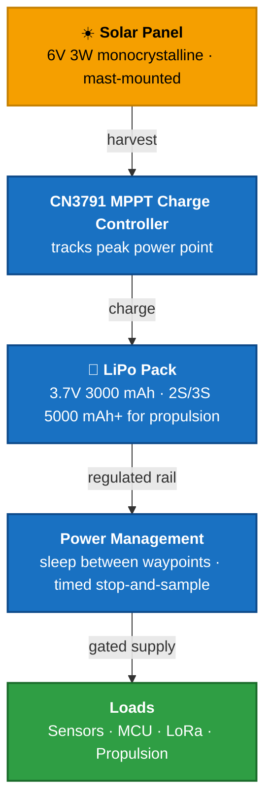

<div align="center">

# 🌊 WQM — River Water Quality Monitor

### A solar-powered sensor boat that patrols Himalayan rivers, streams water quality over LoRa, and predicts pollution **24 hours before it happens**.

<p>
  
  
  
  
  
</p>

<p>
  <a href="#-the-problem">Problem</a> ·
  <a href="#-the-solution">Solution</a> ·
  <a href="#-architecture">Architecture</a> ·
  <a href="#-sensor-suite">Sensors</a> ·
  <a href="#-specifications">Specs</a> ·
  <a href="Sensor_Readme/">Hardware Docs</a>
</p>

</div>

---

## ⚡ TL;DR

|  | |
|:--|:--|
| **What** | A mobile IoT boat node measuring 10 water-quality parameters in real time |
| **Where** | Beas, Uhl, and Suketi rivers — remote Himalayan valleys with no reliable connectivity |
| **How it talks** | LoRa to shore (~2 km LoS) → 4G LTE to cloud |
| **What's smart** | LSTM forecasts the Water Quality Index 24 h ahead; Prophet tracks seasonal decline |
| **What happens next** | WQI breaches IS 10500 / CPCB thresholds → automatic SMS + WhatsApp to authorities |
| **Domain** | Embedded Systems · IoT · AI/ML · Environmental Conservation |

---

## 🏔️ The Problem

Himalayan river ecosystems are degrading fast. Construction runoff goes unmanaged, tourism waste keeps climbing, and accelerated glacial melt is rewriting flow and sediment patterns in the **Beas**, **Uhl**, and **Suketi**.

The monitoring hasn't kept up:

- **Manual sampling misses spikes.** A grab sample is one point in space and time. A toxic discharge at 2 AM is invisible by the time a lab report lands.
- **Lab turnaround is measured in days.** Interventions need hours.
- **The terrain fights you.** Deep valleys mean no Wi-Fi, patchy cellular, and no grid power for fixed stations.

The result: pollution events get detected after they have already moved downstream.

---

## 🚀 The Solution

A **mobile sensor boat** that goes to the water instead of waiting for the water to come to a lab — with prediction layered on top of measurement.

### Four pillars

| | Pillar | What it does |
|:-:|:--|:--|
| 📡 | **Mobile edge sensing** | The boat navigates to a location, waits for the water to stabilize, then samples pH, turbidity, TDS, temperature, DO, conductivity, ORP, and depth. Median filtering and calibration offsets are applied **on the edge**. |
| 📶 | **Long-range telemetry** | No Wi-Fi in a river valley. LoRa carries telemetry ~2 km line-of-sight to a shore gateway, which backhauls over 4G LTE. |
| 🤖 | **Predictive ML** | An LSTM trained on CPCB historical data plus live telemetry forecasts the WQI **24 hours ahead**. |
| 🚨 | **Action, not just dashboards** | Threshold breaches trigger Twilio SMS/WhatsApp alerts to local authorities automatically. |

### Deployment stages



> [!IMPORTANT]
> **Hull design is a work in progress.** The mechanical platform for both stages is under active development. We are targeting hydrodynamic stability in river currents, a rigid centralized probe mast, and battery volume sufficient for propulsion plus payload. Ideas and PRs welcome.

---

## 🏗️ Architecture

A four-tier design, built so that each layer can fail without taking the others down.



<details>
<summary><b>📖 Layer-by-layer breakdown</b></summary>

<br>

**1 · Edge Sensing Layer — the boat**

The primary data acquisition terminal. An STM32F722ZE governs sensor collection and payload generation, and — in Stage 2 — interfaces with navigation modules for waypoint traversal. At each stop it lets the water settle, reads the analog and digital sensor channels, converts raw signals into physical units, and packs them into a compact payload.

**2 · Intermediate Relay Layer — the gateway**

A shore-mounted, pole-mounted box built around an ESP8266 (ESP-12E). It listens continuously for LoRa packets, validates them, appends timestamps, serializes to JSON, and uploads via SIM7600E 4G LTE. It bridges a local RF network to the public internet — nothing more, deliberately.

**3 · Cloud and Analytics Layer**

Firebase Firestore ingests telemetry using a cost-optimized *data bucketing* schema. A Python pipeline runs TensorFlow/Keras LSTM inference and Facebook Prophet seasonal decomposition on Firebase Cloud Functions, keeping heavy compute off the gateway entirely.

**4 · Presentation and Action Layer**

A React 18 SPA subscribes to Firestore real-time feeds for geographic heatmaps and time-series charts. In parallel, server-side threshold monitors fire Twilio alerts the moment current or predicted WQI crosses a limit.

</details>

### One reading, end to end



### Onboard sampling cycle

What the boat actually does at every waypoint — and why power draw stays low.



> [!TIP]
> **Why `Stabilizing` is its own state.** Propellers off, wake settles. Sampling a churned wake gives you turbidity noise, not turbidity data — and it skews DO too. **Why `Sleeping` is its own state.** Non-critical modules power down between waypoints; that idle time is most of the mission, and it is where the power budget is won.

---

## 📡 Sensor Suite

Full part numbers, pricing, and sourcing live in [`Sensor_Readme/WQM_Sensor_BOM.md`](Sensor_Readme/WQM_Sensor_BOM.md).

| Parameter | Model | Range | Accuracy | Interface |
|:--|:--|:--|:--|:--|
| 🧪 **pH** | DFRobot SEN0161 | 0–14 pH | ±0.1 | Analog |
| 🌫️ **Turbidity** | DFRobot SEN0189 | 0–3000 NTU | — | Analog |
| 💧 **TDS** | DFRobot SEN0244 | 0–1000 ppm | temp-compensated | Analog |
| 🌡️ **Water Temp** | DS18B20 ×2 | −55 to +125 °C | ±0.5 °C | OneWire |
| 🫧 **Dissolved O₂** | DFRobot SEN0237-A | 0–20 mg/L | — | Analog |
| ⚡ **Conductivity** | DFRobot DFR0300 (K=1) | 0–20 mS/cm | — | Analog |
| 🔋 **ORP** | DFRobot SEN0165 | ±2000 mV | — | Analog |
| 📏 **Depth** | JSN-SR04T | 20–600 cm | — | Trig/Echo |
| 🌤️ **Air / Pressure** | BME280 | temp + RH + baro | — | I²C |
| 📍 **Position** | NEO-6M / NEO-M8N | global | — | UART |

> [!NOTE]
> **Why calibration matters here.** pH uses two-point buffer calibration (4.0 / 7.0). Turbidity maps analog voltage to NTU through a polynomial curve. DO is calibrated in air-saturated water. TDS is temperature-compensated against the DS18B20. Skip any of these and the WQI is fiction.

---

## 🛠️ Hardware and Stack

<table>
<tr>
<td valign="top" width="25%">

**Compute**

`STM32F722ZE`
`ESP8266 ESP-12E`
`STM32CubeIDE`
`HAL Drivers`

<sub>Chosen for a high-precision hardware ADC and low-power sleep modes — non-negotiable with 7 analog channels.</sub>

</td>
<td valign="top" width="25%">

**Comms**

`LoRa SX1278`
`SIM7600E 4G LTE`
`SPI` · `UART AT`
`SF7–SF12`

<sub>SPI to the MCU, UART AT commands to the modem.</sub>

</td>
<td valign="top" width="25%">

**Power**

`6V 3W Mono Solar`
`CN3791 MPPT`
`18650 LiPo`
`Sleep scheduling`

<sub>Fully off-grid. MPPT keeps harvest up under variable valley light.</sub>

</td>
<td valign="top" width="25%">

**Software**

`Firebase Firestore`
`TensorFlow / Keras`
`Facebook Prophet`
`React 18 + Vite`
`Leaflet · Recharts`
`Twilio API`

</td>
</tr>
</table>

**Enclosures** — Custom boat hull (design pending), sealed with marine silicone, centralized probe mast, cable glands for sensor entry. The gateway lives in an IP65 ABS junction box on a shore pole.

---

## 📋 Specifications

### Edge → Gateway (LoRa)

| | |
|:--|:--|
| **Technology** | LoRa long-range RF |
| **Frequency** | 868 / 915 MHz (433 MHz where regional ISM rules require) |
| **Spreading Factor** | SF7–SF12, configurable — trades range against data rate |
| **Range** | ~2 km line-of-sight · ~500 m NLoS in valley topography |

**Packet format**

```
┌─ LoRa Payload ──────────────────────────────────────────────────────────────────┐
│ node_id │ timestamp │ lat │ lon │  pH  │ turb │ TDS  │ temp │  DO  │ cond │ CRC │
│  1 B    │    4 B    │ 4 B │ 4 B │  2 B │  2 B │  2 B │  2 B │  2 B │  2 B │ 2 B │
└─────────────────────────────────────────────────────────────────────────────────┘
```

### Gateway → Cloud (Cellular)

| | |
|:--|:--|
| **Technology** | 4G LTE |
| **Protocol** | HTTPS with JSON payloads |
| **Bandwidth** | Low — a standard 1.5 GB/day plan covers high-frequency telemetry comfortably |

### Power and Energy



The system is entirely off-grid. Non-critical modules are powered down between waypoints, and the stop-and-sample cycle is timed to minimize awake time — enough autonomy for multiple survey missions without active recharging.

---

## 🧠 Design Decisions Worth Knowing

<details open>
<summary><b>Data bucketing — why we do not write one document per reading</b></summary>

<br>

Firestore bills per operation. A survey mission with hundreds of waypoint readings would mean hundreds of writes.

Instead, the gateway aggregates readings into a **single daily or mission-scoped document**. Writes collapse by orders of magnitude, costs stay flat as the fleet grows, and the frontend gets a whole mission in one read — which is exactly the shape heatmaps and time-series charts want anyway.

</details>

<details open>
<summary><b>Dual-tier ML — two models, two time horizons</b></summary>

<br>

| | **LSTM** — tactical | **Prophet** — strategic |
|:--|:--|:--|
| **Horizon** | 24 hours ahead | Weeks to months |
| **Config** | 2 stacked layers (64 + 32 units), 0.2 dropout | Seasonal decomposition + changepoint detection |
| **Catches** | Sudden spikes — toxic spills, runoff events | Gradual degradation, seasonal patterns |
| **Drives** | Immediate SMS/WhatsApp alerts | Long-term municipal planning |

One model answers *"is something wrong right now?"* The other answers *"is this river getting worse?"* Neither question is optional.

</details>

---

## 📂 Repository Layout

| Path | What is inside |
|:--|:--|
| [`Sensor_Readme/`](Sensor_Readme/) | Hardware documentation hub |
| ├─ [`WQM_Sensor_Suite_Guide.md`](Sensor_Readme/WQM_Sensor_Suite_Guide.md) | Sensor selection rationale and wiring |
| ├─ [`WQM_Sensor_BOM.md`](Sensor_Readme/WQM_Sensor_BOM.md) | Bill of materials — parts, pricing, sourcing |
| └─ [`RC_WQM_Sensor_Guide.md`](Sensor_Readme/RC_WQM_Sensor_Guide.md) | Stage 1 RC boat sensor guide |
| `Core/` *(firmware branch)* | STM32F722ZE HAL firmware — drivers, ADC, telemetry |

---

## 🤝 Contributing

Firmware optimization, ML model improvements, dashboard features, or hull design ideas — all welcome. Open an issue or send a PR.

---

<div align="center">
<sub>Built with 💙 for Himalayan river conservation</sub>
<br>
<sub><b>Embedded Systems</b> · <b>IoT</b> · <b>AI/ML</b> · <b>Environmental Conservation</b></sub>
</div>
